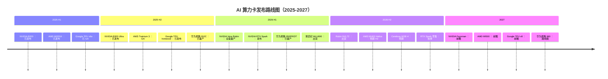

# AI 算力卡未来路线图（2025-2027）

> 基于厂商公告、供应链消息和行业分析。**实际发布时间以厂商官方为准**。最后更新：2026-06-04。

## 2025 Q2-Q4（已发布 / 已量产）

| 时间 | 产品 | 厂商 | 关键信息 |
|---|---|---|---|
| 2025-04 | **NVIDIA B200** | NVIDIA | Blackwell，192GB HBM3e，9 PFLOPS FP8 |
| 2025-04 | **NVIDIA GB200** | NVIDIA | 2× B200 + Grace CPU，LLM 推理旗舰 |
| 2025-05 | **AMD MI355X** | AMD | CDNA 4，288GB HBM3e，5 PFLOPS FP8 dense |
| 2025-06 | **Google TPU v6e (Trillium)** | Google | 918 TFLOPS BF16，32GB HBM，已 GA |
| 2025-08 | **华为昇腾 910C** | 华为 | 双 Die 910B，780 TFLOPS BF16，国内量产 |
| 2025-09 | **NVIDIA B300 Ultra** | NVIDIA | 288GB HBM3e，14 PFLOPS FP4，1,400W 液冷 |
| 2025-12 | **AWS Trainium 3** | AWS | 3nm，5.7 PFLOPS FP8 dense，re:Invent GA |
| 2025-12 | **Google TPU v7 (Ironwood)** | Google | 192GB HBM，2,307 TFLOPS BF16，推理优化 |

## 2026 H1（已发布 / 已量产）

| 时间 | 产品 | 厂商 | 关键信息 |
|---|---|---|---|
| 2026-Q1 | **华为昇腾 950PR / 950DT** | 华为 | 1 PFLOPS FP8，自研 HiBL/HiZQ HBM，已量产 |
| 2026-Q1 | **寒武纪 MLU690** | 寒武纪 | 2 PFLOPS FP8 dense，192GB HBM3E，开始出货 |
| 2026-Q1 | **AMD MI350X** | AMD | CDNA 4，192GB HBM3e，2.5 PFLOPS FP16，已上市 |
| 2026-02 | **摩尔线程 MTT S5000** | 摩尔线程 | 1,000 TFLOPS，80GB GDDR6X，参数公开 |
| 2026-06 | **NVIDIA Vera Rubin R200** | NVIDIA | ✅ **全面量产**（GTC Taipei 宣布）|
| 2026-06 | **NVIDIA RTX Spark** | NVIDIA | 20 核 Grace + Blackwell GPU，1 PFLOPS AI PC 芯片 |

## 2026 H2（即将发布 / 高度预期）

| 时间 | 产品 | 厂商 | 预期规格 |
|---|---|---|---|
| 2026-H2 | **NVIDIA Rubin R200 出货** | NVIDIA | 288GB HBM4，50 PFLOPS FP4，NVLink 6 |
| 2026-H2 | **NVIDIA Rubin NVL72 机柜** | NVIDIA | 72 颗 Rubin + 36 颗 Vera，1.8 EFLOPS FP4 |
| 2026-H2 | **AMD MI400 + Helios 机柜** | AMD | 432GB HBM4，40 PFLOPS FP4，19.6 TB/s |
| 2026-H2 | **Cerebras WSE-4** | Cerebras | 1.4 万亿晶体管，125 PFLOPS FP8 |
| 2026-Q4 | **华为昇腾 950DT 全面放量** | 华为 | 950DT Decode + 训练量产 |
| 2026-秋 | **NVIDIA RTX Spark 零售** | NVIDIA | 华硕/戴尔/惠普/联想/微软首发 |

## 2027（前瞻）

| 时间 | 产品 | 厂商 | 预期方向 |
|---|---|---|---|
| 2027 | **NVIDIA Rubin Ultra / Feynman** | NVIDIA | 下下一代架构，可能走向 Wafer-Scale |
| 2027 | **AMD MI500** | AMD | CDNA 5，HBM4e 或 3D 堆叠 |
| 2027 | **Google TPU v8 8t/8i** | Google | 训练/推理正式拆分，光学互联 |
| 2027-Q4 | **华为昇腾 960** | 华为 | FP8 ~2 PFLOPS，N+3 工艺 |
| 2027 | **Intel Jaguar Shores** | Intel | Xe-HPC + Gaudi 融合架构 |

## 关键技术趋势

### HBM4 / 自研 HBM（2026-2027）

- **HBM4**（NVIDIA Rubin / AMD MI400）：1,024-bit 接口，<strong>2.4+ TB/s/stack</strong>
- **华为自研 HiBL/HiZQ**：中国企业首次实现 HBM 自研量产（950PR/950DT）
- **HBM4e**：2027 年底，可能用于 Rubin Ultra

### 个人 AI 计算（2026 新趋势）

- **NVIDIA RTX Spark**：AI PC 芯片，1 PFLOPS，2026 秋出货
- **Apple M5 Ultra**：本地 LLM 推理，192GB 统一内存
- **Qualcomm Snapdragon X Elite 2**：2027，AI PC 持续进化
- **意义**：AI 算力从数据中心扩展到个人设备

### Wafer-Scale / 机架级（2026+）

- **NVIDIA Rubin NVL72**：72 GPU + 36 CPU，机柜级 AI 工厂
- **AMD Helios**：432GB HBM4，260 TB/s UALink 互联
- **Cerebras WSE-4**：1.4T 晶体管 Wafer-Scale 引擎
- **华为 CloudMatrix 384**：384 芯片互联，总 BF16 算力 ~300 PFLOPS

### 低精度计算（FP4 / INT4）

- **NVIDIA Rubin R200**：50 PFLOPS FP4（稀疏），Blackwell 的 2.8×
- **AMD MI400**：40 PFLOPS FP4（密集），Helios 机柜 ~2 ExaFLOPS
- **华为 HiF8**：自研 FP8 变体，精度接近 FP16
- **趋势**：FP8 → FP4 → INT4，精度换算力，模型越训越"低"

### 国产替代加速（2026 三极格局）

| 厂商 | 旗舰 | 算力 | HBM | 生态 | 状态 |
|------|------|------|-----|------|------|
| **华为** | 昇腾 950DT | 1 PFLOPS FP8 | 自研 HiZQ 144GB | CANN + MindSpore | 已量产 |
| **寒武纪** | MLU690 | 2 PFLOPS FP8 | HBM3E 192GB | NeuWare + MindSpore | 出货中 |
| **摩尔线程** | MTT S5000 | 1,000 TFLOPS | GDDR6X 80GB | MUSA + MUSIFY | 参数公开 |

## 发布时间线（可视化）

## 数据来源与更新

- 厂商官方公告（NVIDIA GTC Taipei 2026、Computex 2026、AMD Advancing AI、华为全联接大会）
- 供应链泄露（DigiTimes、Tom's Hardware、ServeTheHome）
- 行业分析师报告（TrendForce、Jon Peddie Research）
- **最后更新**：2026-06-04，基于 Computex 2026 / GTC Taipei 最新发布

---

[← 返回首页](/docs/intro) | [完整对比表 →](/docs/comparison)
