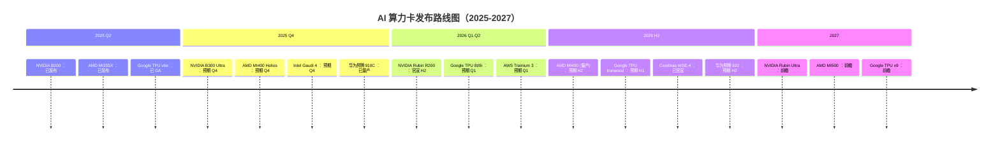

# AI 算力卡未来路线图（2025-2027）

> 基于厂商公告、供应链消息和行业分析。**实际发布时间以厂商官方为准**。

## 2025 Q2-Q3（已发布 / 近期）

| 时间 | 产品 | 厂商 | 关键信息 |
|---|---|---|---|
| 2025-04 | **NVIDIA B200** | NVIDIA | Blackwell，192GB HBM3e，9 PFLOPS |
| 2025-04 | **NVIDIA GB200** | NVIDIA | 2× B200 + Grace CPU，LLM 推理怪兽 |
| 2025-05 | **AMD MI355X** | AMD | CDNA 4，288GB HBM3e，10.1 PFLOPS |
| 2025-06 | **Google TPU v6e (Trillium)** | Google | 918 TFLOPS BF16，32GB HBM，已 GA |
| 2025-08 | **华为昇腾 910C** | 华为 | 双 Die 910B，780 TFLOPS，国内量产 |

## 2025 Q4 - 2026 Q1（即将发布）

| 时间 | 产品 | 厂商 | 预期规格 |
|---|---|---|---|
| 2025-Q4 | **NVIDIA B300 Ultra** | NVIDIA | 288GB HBM3e，14 PFLOPS，1,400W |
| 2025-Q4 | **AMD MI400 (Helios)** | AMD | 432GB HBM4，40 PFLOPS FP4，19.6 TB/s |
| 2025-Q4 | **Intel Gaudi 4** | Intel | 6nm，128GB SRAM，2.4 Tb/s |
| 2026-Q1 | **NVIDIA Rubin R200** | NVIDIA | 288GB HBM4，50 PFLOPS FP4，**2026 H2 旗舰** |
| 2026-Q1 | **Google TPU 8t (训练) + 8i (推理)** | Google | TPU v8 正式拆分训练/推理 |
| 2026-Q1 | **AWS Trainium 3** | AWS | 3nm，~2,000 TFLOPS，128GB HBM |

## 2026 H2（已官宣 / 高度预期）

| 时间 | 产品 | 厂商 | 关键信息 |
|---|---|---|---|
| 2026-H1 | **NVIDIA Rubin R200** | NVIDIA | HBM4，50 PFLOPS FP4，Vera CPU + NVLink 6 |
| 2026-H1 | **AMD MI400 + Helios 机柜** | AMD | 432GB HBM4，260 TB/s UALink，机架级方案 |
| 2026-H1 | **Google TPU Ironwood (v7)** | Google | 192GB HBM，~2,000 TFLOPS BF16 |
| 2026-H1 | **Cerebras WSE-4** | Cerebras | 1.4 万亿晶体管，125 PFLOPS FP8 |
| 2026-H2 | **华为昇腾 920** | 华为 | 900+ TFLOPS BF16，4 Tbps 片间互联 |

## 2027（前瞻）

| 时间 | 产品 | 厂商 | 预期方向 |
|---|---|---|---|
| 2027 | **NVIDIA Rubin Ultra** | NVIDIA | 可能是 Wafer-Scale 或 3D 堆叠方案 |
| 2027 | **AMD MI500** | AMD | CDNA 5，可能引入 HBM4e 或 3D 堆叠 |
| 2027 | **Google TPU v9** | Google | 可能引入光学互联或 3D 堆叠 HBM |
| 2027 | **Intel Jaguar Shores** | Intel | Xe-HPC + Gaudi 融合架构，对标 B200 |

## 关键技术趋势

### HBM4 / HBM4e（2026-2027）

- **HBM4**：1,024-bit 接口，理论带宽 2.4 TB/s/stack，NVIDIA Rubin / AMD MI400 首发
- **HBM4e**：2027 年底，可能用于 Rubin Ultra

### Wafer-Scale / 机架级（2026+）

- **NVIDIA Blackwell-Next / Rubin Ultra**：可能走向 Wafer-Scale（参考 Cerebras）
- **AMD Helios**：机柜级方案，260 TB/s UALink 互联
- **Tesla Dojo v2**：自动标注 + 训练一体化，2026 年目标 100 ExaFLOPS

### 低精度计算（FP4 / INT4）

- **NVIDIA Rubin R200**：50 PFLOPS FP4（稀疏），比 B200 快 5×+
- **AMD MI400**：40 PFLOPS FP4（密集），Helios 机柜总算力 ~2 ExaFLOPS
- **趋势**：FP8 → FP4 → INT4，精度换算力

### 国产替代加速（中国）

- **华为昇腾 910C**（2024 H2）：双 Die 910B，780 TFLOPS
- **华为昇腾 920**（2025 H2）：900+ TFLOPS，4 Tbps 片间互联
- **寒武纪思元 690**：~1,000 TFLOPS，对标 A100
- **摩尔线程 MTT S5000**：~200 TFLOPS，国产 GPU 生态建设

## 发布时间线（可视化）

## 数据来源与更新

- 厂商官方公告（NVIDIA GTC、AMD Advancing AI、Google I/O、华为全联接大会）
- 供应链泄露（DigiTimes、Tom's Hardware、ServeTheHome）
- 学术论文与专利分析
- 行业分析师报告（TrendForce、Jon Peddie Research）

发现信息有误或缺失？[提交 Issue](https://github.com/anomalyco/mirrorfrog/issues)！

---

[← 返回首页](/docs/intro) | [完整对比表 →](/docs/comparison)
