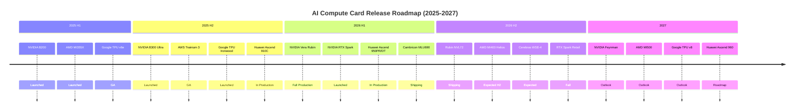

# AI Compute Card Future Roadmap (2025–2027)

> Based on vendor announcements, supply chain reports, and industry analysis. **Actual release dates subject to official vendor confirmation**. Last updated: 2026-06-04.

## 2025 Q2–Q4 (Launched / In Production)

| Date | Product | Vendor | Key Details |
|---|---|---|---|
| 2025-04 | **NVIDIA B200** | NVIDIA | Blackwell, 192GB HBM3e, 9 PFLOPS FP8 |
| 2025-04 | **NVIDIA GB200** | NVIDIA | 2× B200 + Grace CPU, flagship LLM inference |
| 2025-05 | **AMD MI355X** | AMD | CDNA 4, 288GB HBM3e, 5 PFLOPS FP8 dense |
| 2025-06 | **Google TPU v6e (Trillium)** | Google | 918 TFLOPS BF16, 32GB HBM, GA |
| 2025-08 | **Huawei Ascend 910C** | Huawei | Dual-die 910B, 780 TFLOPS BF16, domestic production |
| 2025-09 | **NVIDIA B300 Ultra** | NVIDIA | 288GB HBM3e, 14 PFLOPS FP4, 1,400W liquid-cooled |
| 2025-12 | **AWS Trainium 3** | AWS | 3nm, 5.7 PFLOPS FP8 dense, re:Invent GA |
| 2025-12 | **Google TPU v7 (Ironwood)** | Google | 192GB HBM, 2,307 TFLOPS BF16, inference-optimized |

## 2026 H1 (Launched / In Production)

| Date | Product | Vendor | Key Details |
|---|---|---|---|
| 2026-Q1 | **Huawei Ascend 950PR / 950DT** | Huawei | 1 PFLOPS FP8, in-house HiBL/HiZQ HBM, in production |
| 2026-Q1 | **Cambricon MLU690** | Cambricon | 2 PFLOPS FP8 dense, 192GB HBM3E, shipping |
| 2026-Q1 | **AMD MI350X** | AMD | CDNA 4, 192GB HBM3e, 2.5 PFLOPS FP16, available |
| 2026-02 | **Moore Threads MTT S5000** | Moore Threads | 1,000 TFLOPS, 80GB GDDR6X, specs public |
| 2026-06 | **NVIDIA Vera Rubin R200** | NVIDIA | ✅ **Full production** (announced at GTC Taipei) |
| 2026-06 | **NVIDIA RTX Spark** | NVIDIA | 20-core Grace + Blackwell GPU, 1 PFLOPS AI PC chip |

## 2026 H2 (Upcoming / Highly Anticipated)

| Date | Product | Vendor | Expected Specs |
|---|---|---|---|
| 2026-H2 | **NVIDIA Rubin R200 Shipping** | NVIDIA | 288GB HBM4, 50 PFLOPS FP4, NVLink 6 |
| 2026-H2 | **NVIDIA Rubin NVL72 Rack** | NVIDIA | 72 Rubin + 36 Vera, 1.8 EFLOPS FP4 |
| 2026-H2 | **AMD MI400 + Helios Rack** | AMD | 432GB HBM4, 40 PFLOPS FP4, 19.6 TB/s |
| 2026-H2 | **Cerebras WSE-4** | Cerebras | 1.4 trillion transistors, 125 PFLOPS FP8 |
| 2026-Q4 | **Huawei Ascend 950DT Full Ramp** | Huawei | 950DT Decode + training mass production |
| 2026-Fall | **NVIDIA RTX Spark Retail** | NVIDIA | Asus / Dell / HP / Lenovo / Microsoft launch partners |

## 2027 (Outlook)

| Date | Product | Vendor | Expected Direction |
|---|---|---|---|
| 2027 | **NVIDIA Rubin Ultra / Feynman** | NVIDIA | Next-next-gen architecture, possibly wafer-scale |
| 2027 | **AMD MI500** | AMD | CDNA 5, HBM4e or 3D stacking |
| 2027 | **Google TPU v8 8t/8i** | Google | Training/inference split architecture, optical interconnect |
| 2027-Q4 | **Huawei Ascend 960** | Huawei | FP8 ~2 PFLOPS, N+3 process |
| 2027 | **Intel Jaguar Shores** | Intel | Xe-HPC + Gaudi converged architecture |

## Key Technology Trends

### HBM4 / In-House HBM (2026–2027)

- **HBM4** (NVIDIA Rubin / AMD MI400): 1,024-bit interface, <strong>2.4+ TB/s/stack</strong>
- **Huawei in-house HiBL/HiZQ**: First Chinese enterprise to achieve in-house HBM mass production (950PR/950DT)
- **HBM4e**: Late 2027, likely for Rubin Ultra

### Personal AI Computing (2026 Emerging Trend)

- **NVIDIA RTX Spark**: AI PC chip, 1 PFLOPS, shipping Fall 2026
- **Apple M5 Ultra**: Local LLM inference, 192GB unified memory
- **Qualcomm Snapdragon X Elite 2**: 2027, AI PC continues to evolve
- **Significance**: AI compute extends from datacenters to personal devices

### Wafer-Scale / Rack-Scale (2026+)

- **NVIDIA Rubin NVL72**: 72 GPU + 36 CPU, rack-scale AI factory
- **AMD Helios**: 432GB HBM4, 260 TB/s UALink interconnect
- **Cerebras WSE-4**: 1.4T transistor wafer-scale engine
- **Huawei CloudMatrix 384**: 384-chip interconnect, total BF16 compute ~300 PFLOPS

### Low-Precision Computing (FP4 / INT4)

- **NVIDIA Rubin R200**: 50 PFLOPS FP4 (sparse), 2.8× Blackwell
- **AMD MI400**: 40 PFLOPS FP4 (dense), Helios rack ~2 ExaFLOPS
- **Huawei HiF8**: Proprietary FP8 variant, precision approaching FP16
- **Trend**: FP8 → FP4 → INT4, trading precision for compute, models trained at ever-lower precision

### Domestic Alternatives Accelerating (2026 Three-Pole Landscape)

| Vendor | Flagship | Compute | HBM | Ecosystem | Status |
|------|------|------|-----|------|------|
| **Huawei** | Ascend 950DT | 1 PFLOPS FP8 | In-house HiZQ 144GB | CANN + MindSpore | In production |
| **Cambricon** | MLU690 | 2 PFLOPS FP8 | HBM3E 192GB | NeuWare + MindSpore | Shipping |
| **Moore Threads** | MTT S5000 | 1,000 TFLOPS | GDDR6X 80GB | MUSA + MUSIFY | Specs public |

## Release Timeline (Visual)

## Data Sources & Updates

- Official vendor announcements (NVIDIA GTC Taipei 2026, Computex 2026, AMD Advancing AI, Huawei Connect)
- Supply chain leaks (DigiTimes, Tom's Hardware, ServeTheHome)
- Industry analyst reports (TrendForce, Jon Peddie Research)
- **Last updated**: 2026-06-04, based on Computex 2026 / GTC Taipei latest announcements

Found incorrect or missing information? [Submit an Issue](https://github.com/anomalyco/mirrorfrog/issues)!

---

[← Back to Home](/en/docs/intro) | [Full Comparison Table →](/en/docs/comparison)
