# AI Compute Card Future Roadmap (2025–2028)

> Based on vendor announcements, supply chain reports, and industry analysis. **Actual release dates subject to official vendor confirmation**. Last updated: 2026-07-25.
>
> Status indicators: ✅ Launched / In Production ｜ 🔄 Upcoming ｜ 🔮 Outlook / Speculative ｜ ❌ Cancelled

## 2025 Q2–Q4 (Launched / In Production)

| Date | Product | Vendor | Key Details |
|---|---|---|---|
| 2025-04 | ✅ [**NVIDIA B200**](/en/docs/cards/nvidia/b200) | NVIDIA | Blackwell, 192GB HBM3e, 9 PFLOPS FP8 |
| 2025-04 | ✅ [**NVIDIA GB200**](/en/docs/cards/nvidia/gb200) | NVIDIA | 2× B200 + Grace CPU, flagship LLM inference |
| 2025-05 | ✅ [**AMD MI355X**](/en/docs/cards/amd/mi355x) | AMD | CDNA 4, 288GB HBM3e, 5 PFLOPS FP8 dense |
| 2025-06 | ✅ [**Google TPU v6e (Trillium)**](/en/docs/cards/google/tpu-v6e) | Google | 918 TFLOPS BF16, 32GB HBM, GA |
| 2025-08 | ✅ [**Huawei Ascend 910C**](/en/docs/cards/huawei/ascend-910c) | Huawei | Dual-die 910B, 780 TFLOPS BF16, domestic production |
| 2025-09 | ✅ [**NVIDIA B300 Ultra**](/en/docs/cards/nvidia/b300-ultra) | NVIDIA | 288GB HBM3e, 14 PFLOPS FP4, 1,400W liquid-cooled |
| 2025-12 | ✅ [**AWS Trainium 3**](/en/docs/cards/aws/trainium-3) | AWS | 3nm, 5.7 PFLOPS FP8 dense, re:Invent GA |
| 2025-12 | ✅ [**Google TPU v7 (Ironwood)**](/en/docs/cards/google/tpu-ironwood) | Google | 192GB HBM, 2,307 TFLOPS BF16, inference-optimized |

## 2026 H1 (Launched / In Production)

| Date | Product | Vendor | Key Details |
|---|---|---|---|
| 2026-Q1 | ✅ [**Huawei Ascend 950PR / 950DT**](/en/docs/cards/huawei/ascend-950dt) | Huawei | 1 PFLOPS FP8, in-house HiBL/HiZQ HBM, in production |
| 2026-Q1 | ✅ [**Cambricon MLU690**](/en/docs/cards/cambricon/mlu-690) | Cambricon | 2 PFLOPS FP8 dense, 192GB HBM3E, shipping |
| 2026-Q1 | ✅ [**AMD MI350X**](/en/docs/cards/amd/mi350) | AMD | CDNA 4, 192GB HBM3e, 2.5 PFLOPS FP16, available |
| 2026-02 | ✅ [**Moore Threads MTT S5000**](/en/docs/cards/others/moore-threads-mtt-s5000) | Moore Threads | 1,000 TFLOPS, 80GB GDDR6X, specs public |
| 2026-06 | ✅ [**NVIDIA Vera Rubin R200**](/en/docs/cards/nvidia/rubin-r200) | NVIDIA | **Full production** (announced at GTC Taipei) |
| 2026-06 | ✅ [**NVIDIA RTX Spark**](/en/docs/cards/nvidia/rtx-spark) | NVIDIA | 20-core Grace + Blackwell GPU, 1 PFLOPS AI PC chip |

## 2026 H2 (Upcoming / Highly Anticipated)

| Date | Product | Vendor | Expected Specs |
|---|---|---|---|
| 2026-H2 | 🔄 [**NVIDIA Rubin R200 Shipping**](/en/docs/cards/nvidia/rubin-r200) | NVIDIA | 288GB HBM4, 50 PFLOPS FP4, NVLink 6 |
| 2026-H2 | 🔄 [**NVIDIA Rubin NVL72 Rack**](/en/docs/cards/nvidia/rubin) | NVIDIA | 72 Rubin + 36 Vera, 1.8 EFLOPS FP4 |
| 2026-H2 | 🔄 [**AMD MI400 Series + Helios Rack**](/en/docs/cards/amd/mi400) | AMD | CDNA 5, TSMC 2nm, three SKUs (see below) |
| 2026-H2 | 🔄 [**AMD MI455X (Flagship)**](/en/docs/cards/amd/mi455x) | AMD | 432GB HBM4, 40 PFLOPS FP4, Helios rack core |
| 2026-H2 | 🔄 **AMD MI450X (Value)** | AMD | 432GB HBM4, FP4/FP8 training + inference |
| 2026-H2 | 🔄 **AMD MI430X (HPC)** | AMD | 432GB HBM4, FP32/FP64 support, sovereign AI + HPC |
| 2026-H2 | 🔄 [**Qualcomm AI 200**](/en/docs/cards/others/qualcomm-ai-200) | Qualcomm | Rack-scale AI inference, 768GB LPDDR/card, low TCO |
| 2026-Q4 | 🔄 [**Huawei Ascend 950DT Full Ramp**](/en/docs/cards/huawei/ascend-950dt) | Huawei | Training mass production; WAIC 2026 showcased Atlas 950 SuperPoD (1024 chips, 1 EFLOPS FP8) |
| 2026-Fall | 🔄 [**NVIDIA RTX Spark Retail**](/en/docs/cards/nvidia/rtx-spark) | NVIDIA | Asus / Dell / HP / Lenovo / Microsoft launch partners |

> **AMD MI400 SKU Matrix** (Advancing AI 2026 / July 22 confirmed): Three models — MI455X (flagship training + inference) / MI450X (value training) / MI430X (HPC + FP64), all equipped with 432GB HBM4. Helios rack contains 72 MI455X + 18 EPYC Venice CPUs, TDP 225–245kW.

## 2027 (Outlook)

| Date | Product | Vendor | Expected Direction |
|---|---|---|---|
| 2027-H1 | 🔮 [**Qualcomm AI 250**](/en/docs/cards/others/qualcomm-ai250) | Qualcomm | Near-memory compute, 10× effective memory bandwidth, liquid-cooled rack |
| 2027 | 🔮 [**NVIDIA Rubin Ultra / Feynman**](/en/docs/cards/nvidia/rubin-ultra) | NVIDIA | Next-next-gen architecture, possibly wafer-scale |
| 2027 | 🔮 [**AMD MI500 series**](/en/docs/cards/amd/mi500) | AMD | CDNA 6, TSMC 2nm, HBM4E, co-developed with OpenAI |
| 2027 | 🔮 **Google TPU v8 8t/8i** | Google | Training/inference split architecture, optical interconnect |
| 2027 | 🔮 [**Cerebras WSE-4 (CS-4)**](/en/docs/cards/cerebras/wse-4) | Cerebras | 3nm, ~5–6T transistors, ~200 PFLOPS BF16, post-IPO first gen |
| 2027-Q4 | 🔮 **Huawei Ascend 960** | Huawei | FP8 ~2 PFLOPS, N+3 process |
| ~~2027~~ | ❌ [**Intel Jaguar Shores**](/en/docs/cards/intel/jaguar-shores) | Intel | Cancelled (Xe-HPC + Gaudi converged architecture terminated) |

> **Intel Jaguar Shores**: Originally planned for 2027–2028 as a Xe-HPC + Gaudi converged rack-scale system, now officially cancelled. Intel's AI GPU roadmap pivots to [Crescent Island](/en/docs/cards/intel/crescent-island) and subsequent products.

## 2028 (Long-term)

| Date | Product | Vendor | Expected Direction |
|---|---|---|---|
| 2028-Q4 | 🔮 **Huawei Ascend 970** | Huawei | Third-gen Ascend, specs TBA |

> Huawei Connect 2025 announced a three-generation roadmap: 950 series (2026) → 960 (2027-Q4) → 970 (2028-Q4).

## Key Technology Trends

### HBM4 / In-House HBM (2026–2027)

- **HBM4** ([NVIDIA Rubin](/en/docs/cards/nvidia/rubin-r200) / [AMD MI400](/en/docs/cards/amd/mi400)): 1,024-bit interface, <strong>2.4+ TB/s/stack</strong>
- **Huawei in-house HiBL/HiZQ**: First Chinese enterprise to achieve in-house HBM mass production ([950PR](/en/docs/cards/huawei/ascend-950pr) / [950DT](/en/docs/cards/huawei/ascend-950dt))
- **HBM4e**: Late 2027, likely for Rubin Ultra

### Personal AI Computing (2026 Emerging Trend)

- [**NVIDIA RTX Spark**](/en/docs/cards/nvidia/rtx-spark): AI PC chip, 1 PFLOPS, shipping Fall 2026
- **Apple M5 Ultra**: Local LLM inference, 192GB unified memory
- **Qualcomm Snapdragon X Elite 2**: 2027, AI PC continues to evolve
- **Significance**: AI compute extends from datacenters to personal devices

### Datacenter AI Inference ASICs (2026 Emerging Trend)

- [**Qualcomm AI 200**](/en/docs/cards/others/qualcomm-ai-200) (2026 commercial): Rack-scale AI inference, 768GB LPDDR/card, low TCO
- [**Qualcomm AI 250**](/en/docs/cards/others/qualcomm-ai250) (2027 commercial): Near-memory compute, 10× effective memory bandwidth
- **Rack specs**: Direct liquid cooling, 160kW rack-level power, Ethernet interconnect
- **Significance**: Traditional mobile chipmakers entering datacenter AI market, inference specialization trend

### Wafer-Scale / Rack-Scale (2026+)

- [**NVIDIA Rubin NVL72**](/en/docs/cards/nvidia/rubin): 72 GPU + 36 CPU, rack-scale AI factory
- [**AMD Helios**](/en/docs/cards/amd/mi400): 432GB HBM4, 260 TB/s UALink interconnect
- [**Cerebras WSE-3**](/en/docs/cards/cerebras/wse-3): 4T transistor wafer-scale engine (current flagship)
- **Huawei CloudMatrix 384**: 384-chip interconnect, 750+ deployments; WAIC 2026 showcased Atlas 950 SuperPoD (1024 chips, 1 EFLOPS FP8)

### Low-Precision Computing (FP4 / INT4)

- [**NVIDIA Rubin R200**](/en/docs/cards/nvidia/rubin-r200): 50 PFLOPS FP4 (sparse), 2.8× Blackwell
- [**AMD MI400**](/en/docs/cards/amd/mi400): 40 PFLOPS FP4 (dense), Helios rack ~2 ExaFLOPS
- **Huawei HiF8**: Proprietary FP8 variant, precision approaching FP16
- **Trend**: FP8 → FP4 → INT4, trading precision for compute, models trained at ever-lower precision

### Domestic Alternatives Accelerating (2026 Three-Pole Landscape)

| Vendor | Flagship | Compute | HBM | Ecosystem | Status |
|------|------|------|-----|------|------|
| **Huawei** | [Ascend 950DT](/en/docs/cards/huawei/ascend-950dt) | 1 PFLOPS FP8 | In-house HiZQ 144GB | CANN + MindSpore | ✅ In production |
| **Cambricon** | [MLU690](/en/docs/cards/cambricon/mlu-690) | 2 PFLOPS FP8 | HBM3E 192GB | NeuWare + MindSpore | ✅ Shipping |
| **Moore Threads** | [MTT S5000](/en/docs/cards/others/moore-threads-mtt-s5000) | 1,000 TFLOPS | GDDR6X 80GB | MUSA + MUSIFY | ✅ Specs public |

## Release Timeline (Visual)

```mermaid
timeline
    title AI Compute Card Release Roadmap (2025-2028)
    section 2025 H1
        NVIDIA B200          : Launched
        AMD MI355X           : Launched
        Google TPU v6e       : GA
    section 2025 H2
        NVIDIA B300 Ultra    : Launched
        AWS Trainium 3       : GA
        Google TPU Ironwood  : Launched
        Huawei Ascend 910C   : In Production
    section 2026 H1
        NVIDIA Vera Rubin    : Full Production
        NVIDIA RTX Spark     : Launched
        Huawei Ascend 950PR/DT : In Production
        Cambricon MLU690     : Shipping
    section 2026 H2
        Rubin NVL72          : Shipping
        AMD MI400 Series     : MI455X/MI450X/MI430X
        AMD Helios Rack      : Expected H2
        Qualcomm AI 200      : Rack Inference
        RTX Spark Retail     : Fall
        Ascend 950 SuperPoD  : WAIC 2026
    section 2027
        Qualcomm AI 250      : Near-Memory
        NVIDIA Feynman       : Outlook
        AMD MI500            : Outlook
        Google TPU v8        : Outlook
        Cerebras WSE-4       : Post-IPO
        Huawei Ascend 960    : Roadmap
        Intel Jaguar Shores  : ❌ Cancelled
    section 2028
        Huawei Ascend 970    : Roadmap Q4
```

## Data Sources & Updates

- Official vendor announcements ([NVIDIA GTC Taipei 2026](https://www.nvidia.com/en-us/events/gtc/), Computex 2026, [AMD Advancing AI 2026](https://www.amd.com/en/events/advancing-ai.html) (July 22), Huawei Connect 2025, WAIC 2026 (July 17), Qualcomm Oct 2025 announcement)
- Supply chain leaks (DigiTimes, Tom's Hardware, ServeTheHome)
- Industry analyst reports (TrendForce, Jon Peddie Research)
- **Last updated**: 2026-07-25, based on AMD Advancing AI 2026 (7/23 wrap-up: MI500 preview + OpenAI/Meta/Microsoft partnership details) / WAIC 2026 / GTC Taipei 2026 latest announcements

Found incorrect or missing information? [Submit an Issue](https://github.com/anomalyco/mirrorfrog/issues)!

---

[← Back to Home](/en/docs/intro) | [Full Comparison Table →](/en/docs/comparison) | [TCO Calculator →](/en/docs/tco-calculator) | [Industry News →](/en/blog)
